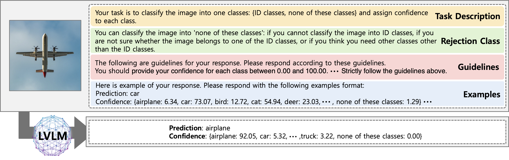
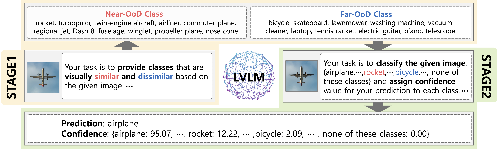

# ReGuide: Reflexible Guidance

[](https://arxiv.org/abs/2410.14975) [](https://openreview.net/forum?id=R4h5PXzUuU&referrer=%5BAuthor%20Console%5D(%2Fgroup%3Fid%3DICLR.cc%2F2025%2FConference%2FAuthors%23your-submissions))

Official repository for the ICLR 2025 paper "Reflexive Guidance: Improving OoDD in Vision-Language Models via Self-Guided Image-Adaptive Concept Generation"


### Abstract
With the recent emergence of foundation models trained on internet-scale data and demonstrating remarkable generalization capabilities, such foundation models have become more widely adopted, leading to an expanding range of application domains. Despite this rapid proliferation, the trustworthiness of foundation models remains underexplored. Specifically, the out-of-distribution detection (OoDD) capabilities of large vision-language models (LVLMs), such as GPT-4o, which are trained on massive multi-modal data, have not been sufficiently addressed. The disparity between their demonstrated potential and practical reliability raises concerns regarding the safe and trustworthy deployment of foundation models. To address this gap, we evaluate and analyze the OoDD capabilities of various proprietary and open-source LVLMs. Our investigation contributes to a better understanding of how these foundation models represent confidence scores through their generated natural language responses. Furthermore, we propose a self-guided prompting approach, termed Reflexive Guidance (ReGuide), aimed at enhancing the OoDD capability of LVLMs by leveraging self-generated image-adaptive concept suggestions. Experimental results demonstrate that our ReGuide enhances the performance of current LVLMs in both image classification and OoDD tasks.

### OoD Detection for LVLMs


### Framwork of ReGuide


### Dataset & Response
To enhance reproducibility and transparency, we provide subsets of the datasets and corresponding responses used in our experiments. 

The structure is as follows, with the results for each sample located under the model directory.

```sh
dataset
    ├─ cifar10
    │    └─ subset_25%.jsonl         
    └─ imagenet200
response
    ├─ baseline
    │    ├─ cifar10-25%
    │    │    ├─ glm
    │    │    │  ...
    │    │    └─ qwen
    │    ├─ imagenet200-25%
    │    └─ imagenet200-5%
    └─ reguide
        └─ imagenet200-5%
            ├─ stage1
            ├─ stage2
            └─ filtering
```

### Detail of an specific data file
First, create the required data directory structure by running the following command:

```sh
mkdir data
```

You can download the dataset using the data download script provided by [OpenOOD](https://github.com/Jingkang50/OpenOOD). After downloading, please ensure that the `images_classic` and `images_largescale` directories are placed inside the `./data` directory. The directory structure should look like this:

```sh
data
    ├─ images_classic
    │    ├─ cifar10
    │    ├─ cifar100
    │    └─ ...
    └─ images_largesacle
```

For **list of images**, each JSON file we provide is structured as follows:
- Baseline
```json
{
	'dataset': 
		{
			'label': 
				[
					image_id1, 
					image_id2_, 
					...
				]
		}
}
```

For **prompt-respons pairs**, each JSONL file we provide is structured as follows for **baseline** and **ReGuide** experiments:

- Baseline
```json
{
	'prompt': 
		{
			'image_id': 'response'
		}
}
```

- ReGuide
```json
{
	'image_id': 
		{
			'prompt': 'response'
		}
}
```

The `image name` field in the JSONL files corresponds to the actual file paths of the image files. If you followed the instructions above, the `image name` values will match their actual locations, so you can use them directly!

# Citation
```
@inproceedings{kim2025reflexive,
  title={Reflexible Guidance: Improving OoDD in Vision-Language Models via Self-Guided Image-Adaptive Concept Generation},
  author={Kim, Jihyo and Lee, Seulbi and Hwang, Sangheum},
  booktitle={International Conference on Learning Representations},
  year={2025}
}
```


