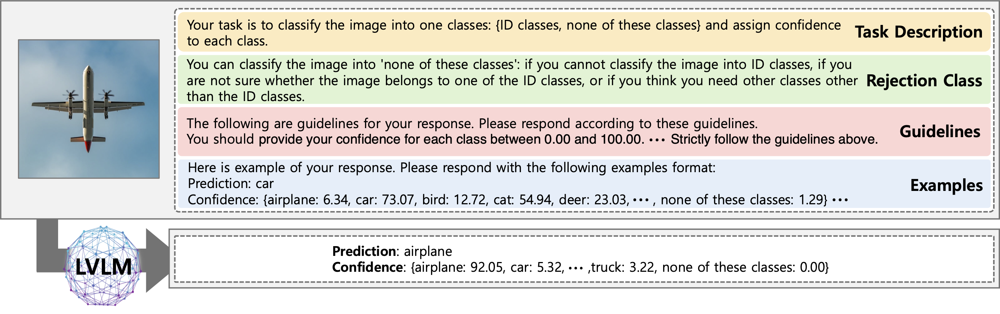
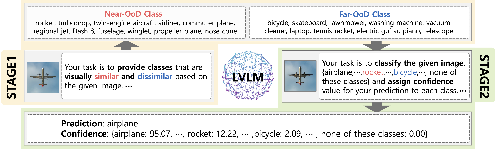

# ReGuide
Official repository for "Reflexible Guidance: Improving OoDD in Vision-Language Models via Self-Guided Image-Adaptive Concept Generation"

## Framework: OoDD in Vision-Language Models


## Reflexive Guidance


### Citation
```
@inproceedings{kim2025reflexive,
  title={Reflexible Guidance: Improving OoDD in Vision-Language Models via Self-Guided Image-Adaptive Concept Generation},
  author={Kim, Jihyo and Lee, Seulbi and Hwang, Sangheum},
  booktitle={International Conference on Learning Representations},
  year={2025}
}
```
